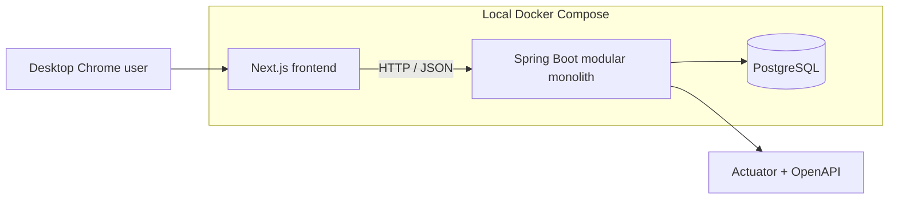

<div align="center">

# Global-Ready

### Practise explaining the software you built — in the English an interview needs.

<p>
  <code>Java 25</code> · <code>Spring Boot 4</code> · <code>Next.js 16</code> · <code>PostgreSQL 18</code> · <code>Docker Compose</code>
</p>

<p><strong>M1 — reproducible foundation</strong> · local-first · zero-cost · no API key required</p>

</div>

Global-Ready is a portfolio project for practising English software-engineering
interviews while rebuilding modern Java/Spring skills. It is designed to stay
locally runnable, privacy-conscious, and demonstrable without paid services.

## Media boundary

See the [media-rights and provenance contract](MEDIA_NOTICE.md) before adding
any reference asset. Source-code license does not grant media rights. The
browser obtains approved media directly; database/backend transport never
carries media bytes.

> **Current checkpoint:** M1 provides the production-shaped infrastructure.
> Interview behaviour starts in M2; it is intentionally not represented by
> empty domain entities or placeholder APIs in this release.

## Choose your path

| I want to… | Start here |
|---|---|
| Run the complete stack quickly | [Docker quick start](#quick-start-run-everything-with-docker) |
| Work on backend or frontend code | [Development mode](#development-mode-docker-database-local-backend-and-frontend) |
| Run beside VMarble without port conflicts | [Run alongside VMarble](#run-alongside-vmarble) |
| Understand the design | [System architecture](#system-architecture) |
| Diagnose a local problem | [Troubleshooting](#common-troubleshooting) |

## What the MVP will do

One anonymous desktop-Chrome user pastes project context, completes up to six
English project deep-dive turns through browser speech recognition or text, and
receives evidence-grounded Vietnamese feedback. The app stores no audio and
expires session data after 24 hours.

## System architecture



The backend is a **modular monolith**: one Spring Boot deployable, one database,
and domain modules inside the codebase. This keeps M1 simple to run while
leaving clear boundaries for the M2/M3 interview workflow. See
[the architecture record](docs/04_ARCHITECTURE.md) and
[ADR 0001](docs/adr/0001-modular-monolith-monorepo.md) for the reasoning.

## Technology baseline

| Component | Version |
|---|---|
| Java | 25; Docker image Temurin 25.0.4+7 |
| Spring Boot | 4.1.1 |
| Gradle Wrapper | 9.3.0 |
| Springdoc OpenAPI | 3.0.3 |
| PostgreSQL | 18.6 |
| Node.js | 24.19.0 |
| Next.js | 16.3.2 |
| React | 19.2.8 |
| TypeScript | 5.9.3 |

Spring Boot 4.1.1 officially supports Java 17 through 26. Next.js requires
Node.js 20.9 or later; this repository pins Node 24 for reproducibility.

## Repository structure

```text
global-ready/
├── backend/          Spring MVC, JPA, Flyway, Actuator, OpenAPI
├── frontend/         Next.js App Router and TypeScript
├── docs/             Canonical v0.2 specification and ADRs
├── compose.yaml
└── .env.example
```

| Area | Responsibility now | Starts later |
|---|---|---|
| `backend/` | HTTP foundation, health, OpenAPI, JPA/Flyway wiring, observability | Session, turn and report modules |
| `frontend/` | Next.js app shell and M1 status page | Interview, speech and report UI |
| `docs/` | Product contract, ADRs and milestone gates | Updated with owner-led decisions |
| `compose.yaml` | Isolated local PostgreSQL, backend and frontend stack | Continues as the local acceptance environment |

## Required local tools

- Docker Desktop or Colima with Docker CLI and Docker Compose;
- JDK 25 when running the backend outside Docker;
- Node.js 24.19.0 and npm when running the frontend outside Docker. The
  frontend includes `.nvmrc` for `nvm` users.

No Gemini key is needed for M1 or the future default fake-provider path.

Check which Docker Compose command is available:

```bash
docker compose version
```

If that command is unavailable but `docker-compose version` works, replace
`docker compose` with `docker-compose` in every example below.

## Run alongside VMarble

Global-Ready and VMarble use separate Docker Compose projects, containers,
networks, and PostgreSQL volumes. Do **not** run `docker compose down` from the
VMarble directory when operating this project, and do not remove Docker volumes
to resolve a host-port conflict.

On the current development workstation, VMarble occupies host ports `8080`
(backend) and `5433` (PostgreSQL). Global-Ready can run safely with this layout:

| Service | VMarble host port | Global-Ready host port |
|---|---:|---:|
| Backend | `8080` | `8081` |
| PostgreSQL | `5433` | `5432` |
| Frontend | — | `3001` |

Create a local `.env` for this non-conflicting layout:

```bash
cp .env.example .env
```

Then set these three values in `.env`:

```dotenv
BACKEND_PORT=8081
FRONTEND_PORT=3001
NEXT_PUBLIC_API_BASE_URL=http://localhost:8081
```

Start only Global-Ready from this repository directory:

```bash
docker compose --profile app up --build -d
```

This never restarts VMarble. Confirm that only Global-Ready containers changed:

```bash
docker compose ps
```

Open <http://localhost:3001> and check
<http://localhost:8081/actuator/health>. If the port usage differs on another
machine, replace the Global-Ready host ports with any unused values and keep
`NEXT_PUBLIC_API_BASE_URL` aligned with `BACKEND_PORT`.

## Configuration

Compose has safe local defaults, so `.env` is optional. Copy the example when
you want a visible place to change ports or database credentials:

```bash
cp .env.example .env
```

The main variables are:

| Variable | Default | Purpose |
|---|---:|---|
| `POSTGRES_DB` | `global_ready` | Local PostgreSQL database |
| `POSTGRES_USER` | `global_ready` | Local PostgreSQL user |
| `POSTGRES_PASSWORD` | `global_ready` | Local PostgreSQL password |
| `POSTGRES_PORT` | `5432` | PostgreSQL port exposed on the host |
| `BACKEND_PORT` | `8080` | Backend port exposed on the host |
| `FRONTEND_PORT` | `3000` | Frontend port exposed on the host |
| `NEXT_PUBLIC_API_BASE_URL` | `http://localhost:8080` | Backend URL embedded in the frontend build |

The defaults are development-only credentials. Do not reuse them in a public
or production environment.

## Quick start: run everything with Docker

This is the simplest way to start PostgreSQL, backend, and frontend together:

```bash
docker compose --profile app up --build
```

The first run downloads the pinned base images and builds both application
images, so it takes longer than later runs. Wait until the backend and frontend
logs report that they are ready, then open:

- frontend: <http://localhost:3000>
- backend health: <http://localhost:8080/actuator/health>
- OpenAPI JSON: <http://localhost:8080/api-docs>
- Swagger UI: <http://localhost:8080/swagger-ui>

Run the same stack in the background:

```bash
docker compose --profile app up --build -d
```

Check container status and logs:

```bash
docker compose ps
docker compose logs -f backend
docker compose logs -f frontend
```

Press `Ctrl+C` to leave foreground mode. Stop and remove the application
containers and network with:

```bash
docker compose down
```

The named PostgreSQL volume is retained by `docker compose down`, so local data
survives the next start.

## Run only selected services with Docker

Start only PostgreSQL:

```bash
docker compose up -d postgres
```

Build and start the backend plus its PostgreSQL dependency, without starting
the frontend:

```bash
docker compose --profile app up --build backend
```

Start the complete dependency chain needed by the frontend:

```bash
docker compose --profile app up --build frontend
```

Because `frontend` depends on `backend`, and `backend` depends on `postgres`,
the last command starts all three services. To start only the frontend
container for a UI-only check, use `--no-deps`:

```bash
docker compose --profile app up --build --no-deps frontend
```

In UI-only mode, the backend health link will not work unless a backend is
already available at `NEXT_PUBLIC_API_BASE_URL`.

## Development mode: Docker database, local backend and frontend

Development mode gives Gradle and Next.js direct access to the source tree and
is the recommended setup while writing code.

### 1. Start PostgreSQL

From the repository root:

```bash
docker compose up -d postgres
docker compose ps postgres
```

Wait until PostgreSQL is reported as `healthy`.

### 2. Start the backend

Open another terminal:

```bash
cd backend
./gradlew bootRun
```

The Gradle Wrapper downloads Gradle automatically on its first run. A global
Gradle installation is not required. The backend connects to PostgreSQL on
`localhost:5432` using the Compose defaults.

Confirm the backend is ready:

```bash
curl --fail http://localhost:8080/actuator/health
curl --fail http://localhost:8080/api-docs
```

### 3. Start the frontend

Open a third terminal:

```bash
cd frontend
nvm use
npm ci
npm run dev
```

Run `npm ci` on the first setup and whenever `package-lock.json` changes. For
later starts, `npm run dev` is sufficient. Open <http://localhost:3000>.

### 4. Stop development services

Press `Ctrl+C` in the backend and frontend terminals, then stop PostgreSQL:

```bash
docker compose down
```

## Port conflicts

If port `8080` is already used, set an alternative backend port in `.env`:

```dotenv
BACKEND_PORT=8081
NEXT_PUBLIC_API_BASE_URL=http://localhost:8081
```

Then rebuild the frontend because `NEXT_PUBLIC_API_BASE_URL` is embedded during
its Docker build:

```bash
docker compose --profile app up --build
```

For local development without Compose application containers, start the two
applications with matching values:

```bash
cd backend
SERVER_PORT=8081 ./gradlew bootRun
```

In the frontend terminal:

```bash
cd frontend
NEXT_PUBLIC_API_BASE_URL=http://localhost:8081 npm run dev
```

The backend health endpoint is then
<http://localhost:8081/actuator/health>.

## Colima and Testcontainers

Ordinary Compose commands work with the active Colima Docker context. Java
Testcontainers may additionally need explicit socket settings. Replace
`<macOS-user>` with the current macOS account name:

```bash
export DOCKER_HOST=unix:///Users/<macOS-user>/.colima/default/docker.sock
export TESTCONTAINERS_DOCKER_SOCKET_OVERRIDE=/var/run/docker.sock
```

Set those variables in the terminal before running backend tests. Docker
Desktop and standard Linux Docker installations normally do not need them.

## Verify the project

Validate the Compose file without starting containers:

```bash
docker compose config
docker compose --profile app config
```

Run backend compilation, unit tests, and PostgreSQL Testcontainers integration
tests:

```bash
cd backend
./gradlew check
```

Run frontend linting, route type generation, TypeScript checks, and a production
build:

```bash
cd frontend
npm ci
npm run check
```

Build both application images as the final container gate:

```bash
docker compose --profile app build
```

## Common troubleshooting

### Backend cannot bind to port 8080

Find the process using the port, stop it if appropriate, or follow the
[port-conflict instructions](#port-conflicts) to use port `8081`.

### Backend cannot connect to PostgreSQL

Check the database health and logs:

```bash
docker compose ps postgres
docker compose logs postgres
```

For a locally running backend, PostgreSQL must be exposed at the host and port
configured by `DATABASE_URL`. The default is
`jdbc:postgresql://localhost:5432/global_ready`.

### Testcontainers cannot find Docker

Confirm Docker is running:

```bash
docker info
```

Colima users should export both variables from the
[Colima section](#colima-and-testcontainers) in the same terminal that runs
Gradle.

### Frontend reports an unsupported Node engine

Activate the pinned Node version before installing dependencies:

```bash
cd frontend
nvm install
nvm use
node --version
```

The expected version is `v24.19.0`.

### Rebuild after dependency changes

Rebuild without reusing application image layers:

```bash
docker compose --profile app build --no-cache backend frontend
docker compose --profile app up
```

## Service URLs

- frontend: <http://localhost:3000>
- backend health: <http://localhost:8080/actuator/health>
- OpenAPI JSON: <http://localhost:8080/api-docs>
- Swagger UI: <http://localhost:8080/swagger-ui>

## M1 boundaries

Included:

- reproducible backend/frontend scaffolds;
- pinned dependencies and container images;
- PostgreSQL/Flyway/Testcontainers wiring;
- health and OpenAPI endpoints;
- virtual threads;
- injected UTC `Clock`;
- ECS JSON logging with correlation IDs;
- safe environment configuration;
- frontend landing/checkpoint page;
- independent CI jobs.

Not implemented yet:

- anonymous access and session token;
- session/turn/report entities;
- migrations for domain tables;
- fake or Gemini gateways;
- speech recognition and synthesis UI;
- interview/report flow.

Those begin at M2/M3 according to [the milestone plan](docs/08_MILESTONE_PLAN.md).

## Documentation

Start with:

1. [approved decisions](docs/02_ASSUMPTIONS_AND_DECISIONS.md);
2. [SRS](docs/03_SRS.md);
3. [architecture](docs/04_ARCHITECTURE.md);
4. [data/API contract](docs/05_DATA_AND_API.md);
5. [milestone plan](docs/08_MILESTONE_PLAN.md);
6. [readiness gate](docs/10_CHANGELOG_AND_READINESS.md);
7. [M1 implementation handoff](docs/11_M1_IMPLEMENTATION_HANDOFF.md);
8. [SDLC and Codex workflow](docs/12_CODEX_WORKFLOW.md).

The old `CLAUDE_MILESTONE_PROMPT.md` is retained only as planning history.

## Privacy and zero-cost rules

- Never persist raw audio.
- Never log raw CV, JD, answers, report, provider prompts, tokens, or provider payloads.
- Keep the complete fake-provider path runnable without API keys.
- Use only synthetic/anonymised data for a public demo until current provider/hosting terms are reviewed.
- Public hosting is optional; local Docker is the acceptance environment.

## Dependency note

Next.js announced another security release for 2026-08-26. This scaffold pins the current registry release available on 2026-08-24. Run `npm audit` and upgrade to the patched supported release before any public deployment. ESLint 9 is retained because the current Next.js lint plugin chain does not yet accept ESLint 10 without invalid peer dependencies.

PostgreSQL 18 uses a version-specific `PGDATA` and its Docker volume is intentionally mounted at `/var/lib/postgresql`, not the pre-18 `/var/lib/postgresql/data` path.

## CV rule

Do not replace the capstone entry yet. Global-Ready becomes CV-ready only after M7 tests, demo evidence, limitations, and an owner-led code defence are complete.
